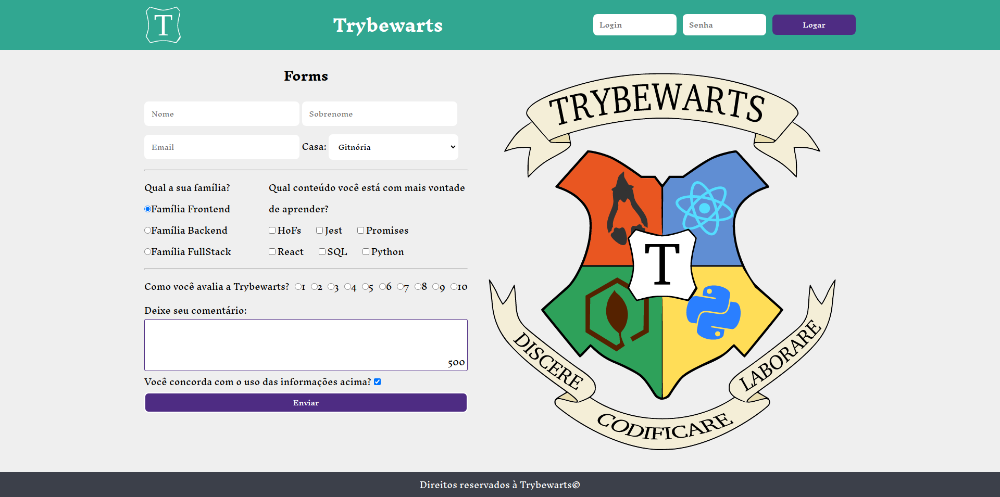

# Projeto Shopping Cart

## Descrição

Neste projeto, é desenvolvido uma página de formulário da Escola de Magia de Trybewarts, em que as pessoas estudantes poderão enviar seus feedbacks sobre a escola. O tema desse projeto é baseado na obra 'Harry Potter', de J. K. Rowling, já que programar é o mais próximo que podemos chegar de algo _verdadeiramente mágico_!

Nesse projeto, você será capaz de:

- Criar formulários em HTML;
- Utilizar CSS Flexbox para criar layouts flexíveis;
- Criar regras CSS específicas para serem aplicadas a dispositivos móveis;
- Construir páginas que alteram o seu layout de acordo com a orientação da tela;
- Trabalhar com funções assíncronas;



---

## Instale as dependências:

- `npm install`

- Verifique que você está na branch `main`

### ESLint e Stylelint

Para garantir a qualidade do código, são utilizados neste projeto os linters `ESLint` e `Stylelint`.

Assim o código estará alinhado com as boas práticas de desenvolvimento, sendo mais legível

e de fácil manutenção! Para rodá-los localmente no projeto, execute os comandos abaixo:

```bash

npm run lint

npm run lint:styles

```

### Cypress

Você pode rodar o cypress localmente para verificar se seus requisitos estão passando, para isso execute um dos seguintes comandos:

Para executar os testes apenas no terminal:

```bash

npm test

```

Para executar os testes e vê-los rodando em uma janela de navegador:

```bash

npm run cypress:open

```

**_ou_**

```bash

npx cypress open

```

---
